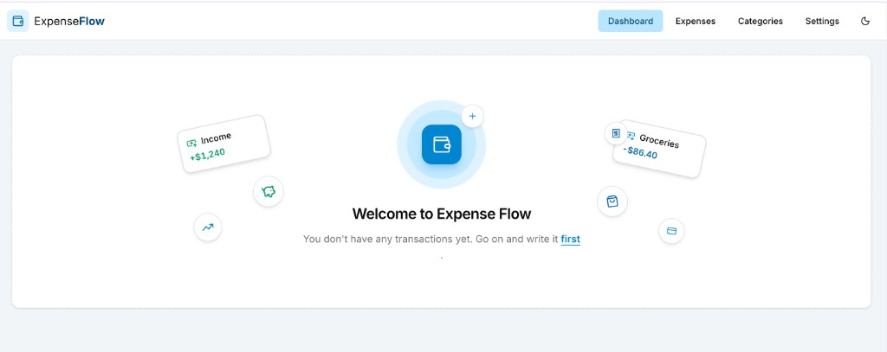

# Expense Flow

Expense Flow is a personal finance app for tracking income and expenses. It is an **MVP in active development** — the feature set will change as the project evolves.

[Live demo](https://bleir.github.io/expense-flow-app/)

The dashboard is the starting point. When you have no transactions yet, it shows a welcome card and a link to add the first one. After that, it shows a 30-day spending chart and a short list of recent activity.

## What it does

- **Expenses** — add, edit, and delete income or expense transactions, with amount, date, category, and notes
- **Categories & budgets** — group spending and set a monthly budget per category
- **Dashboard** — see the last 30 days of income and expenses on a chart, plus recent transactions
- **Settings** — pick a currency, manage category colors, and switch light or dark theme

The app is a pnpm monorepo: a Next.js frontend in `frontend` and a NestJS API in `backend`.
